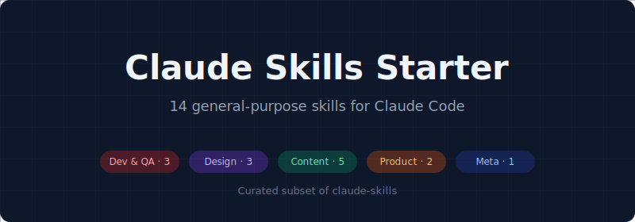

<p align="center">
  
</p>

# Claude Skills Starter

[](#whats-included)
[](LICENSE)

A curated subset of the [claude-skills](https://github.com/rampstackco/claude-skills) catalog. 14 skills selected for broad applicability and low overlap, designed as the starting point for Claude Code users who want a focused skill set without loading the full 102-skill catalog.

## Why a starter set

The full claude-skills catalog has 102 skills across marketing, SEO, design, product, and development. That depth is useful for specialized work, but it has tradeoffs for everyday use:

- Claude Code performs better with fewer skills loaded (less context overhead, faster skill matching)
- New users often find 102 skills hard to navigate
- Many real projects only need a handful of skill categories

claude-skills-starter solves this with 14 broadly useful skills covering the most common workflows: code review, QA, performance, frontend and design, content, SEO, conversion, product specs, and skill authoring.

When you outgrow the starter set, the full catalog is one repo away.

## Trust and security

These skills are a curated starter set of
[rampstackco/claude-skills](https://github.com/rampstackco/claude-skills) and
follow the same review and integrity process. Each file is hashed in
`SKILLS.lock` for verification. To report a security issue, see the
[security policy](https://github.com/rampstackco/claude-skills/security/policy).

## What's included

### Development and QA (3 skills)

| Skill | Purpose |
|---|---|
| code-review-web | Review web application code for bugs, security issues, performance problems, and stack-specific anti-patterns |
| qa-testing | Run QA testing on a page, feature, or full site at three depth tiers (smoke, standard, full) |
| performance-optimization | Diagnose and fix web performance issues including Core Web Vitals, bundle size, and render performance |

### Design and frontend (3 skills)

| Skill | Purpose |
|---|---|
| accessibility-audit | Run a comprehensive WCAG accessibility audit and systematically remediate issues |
| design-standards | Apply production-grade design standards when building or reviewing pages, components, or UI |
| frontend-component-build | Build production-ready frontend components with accessible markup, sensible props, and defined states |

### Content and SEO (5 skills)

| Skill | Purpose |
|---|---|
| content-strategy | Develop a content strategy covering editorial positioning, pillars, formats, calendar, and governance |
| content-and-copy | Write or edit website copy, blog content, and editorial pieces with attention to voice and structure |
| seo-keyword | Run keyword research, classify by search intent, cluster into topical groups, and prioritize |
| seo-onpage | Run an on-page SEO audit covering titles, meta descriptions, header structure, content, and internal links |
| seo-aeo-geo | Optimize content and site structure for AI-driven search (AI overviews, LLM citations, answer engines) |

### Product and conversion (2 skills)

| Skill | Purpose |
|---|---|
| pm-spec-writing | Translate ideas, feature requests, or vague concepts into specific, actionable dev briefs |
| cro-optimization | Run conversion rate optimization through hypothesis-driven testing, analysis, and rollout |

### Skill authoring (1 skill)

| Skill | Purpose |
|---|---|
| skill-creation-walkthrough | Step-by-step guide for creating your own Claude Skills, from scoping to writing the SKILL.md |

## Installation

Clone this repository, then point Claude Code at the `skills/` directory according to your harness's configuration.

```bash
git clone https://github.com/rampstackco/claude-skills-starter.git
```

Each skill is a folder under `skills/` containing a `SKILL.md` and, where applicable, a `references/` subfolder with supporting material.

## When to use the full catalog instead

If your work requires any of these areas, reach for the full [claude-skills](https://github.com/rampstackco/claude-skills) catalog:

- Brand work (identity, voice, style guides, logo design, archetypes)
- Deep SEO audits powered by the Ahrefs MCP (backlink, competitor, rank tracking, traffic diagnosis)
- Interactive and conversion-flow design (calculators, configurators, multi-step forms, onboarding wizards)
- Paid media and ads strategy
- Analytics and experimentation programs
- Program management (roadmaps, OKRs, launch playbooks, incident response)

The starter set and full catalog are designed to coexist. You can clone both and selectively enable what each project needs.

## Family repos

This catalog is part of the Claude Skills family. Other family repos:

| Repo | Focus | Skills |
|---|---|---|
| [claude-skills](https://github.com/rampstackco/claude-skills) | Full catalog | 102 |
| [claude-skills-seo](https://github.com/rampstackco/claude-skills-seo) | SEO consulting | 12 |
| [claude-skills-pm](https://github.com/rampstackco/claude-skills-pm) | Product management | 12 |
| [claude-skills-widgets](https://github.com/rampstackco/claude-skills-widgets) | UI patterns + components | 65 + 32 |
| [awesome-claude-skills](https://github.com/rampstackco/awesome-claude-skills) | Curated discovery list | n/a |

Each family repo is MIT-licensed, conforms to the [Agent Skills Specification](https://agentskills.io), and is stack-agnostic. Use the full catalog for breadth; use a specialty subset when working in one domain.

## Contributing

This repository is curated rather than open to broad contribution. The skill list is deliberately small. If you find a skill from the full claude-skills catalog that you think belongs in the starter set, open a discussion at [claude-skills discussions](https://github.com/rampstackco/claude-skills/discussions). Skill content changes should be made to the source repository at claude-skills, not here.

If you spot a bug in how the starter set has copied or referenced a skill, please open an issue. See [CONTRIBUTING.md](CONTRIBUTING.md) for details.

## License

MIT. Use freely in commercial and non-commercial projects. See [LICENSE](LICENSE).

## Source attribution

Every skill in this repository is copied verbatim from the [claude-skills](https://github.com/rampstackco/claude-skills) catalog, where all 102 skills live in a single flat `skills/` directory. This starter repo keeps the same flat structure. No skill content has been modified; updates flow from the source repository.

The 14 skills in this starter set:

| Skill | Group |
|---|---|
| code-review-web | Development and QA |
| qa-testing | Development and QA |
| performance-optimization | Development and QA |
| accessibility-audit | Design and frontend |
| design-standards | Design and frontend |
| frontend-component-build | Design and frontend |
| content-strategy | Content and SEO |
| content-and-copy | Content and SEO |
| seo-keyword | Content and SEO |
| seo-onpage | Content and SEO |
| seo-aeo-geo | Content and SEO |
| pm-spec-writing | Product and conversion |
| cro-optimization | Product and conversion |
| skill-creation-walkthrough | Skill authoring |
